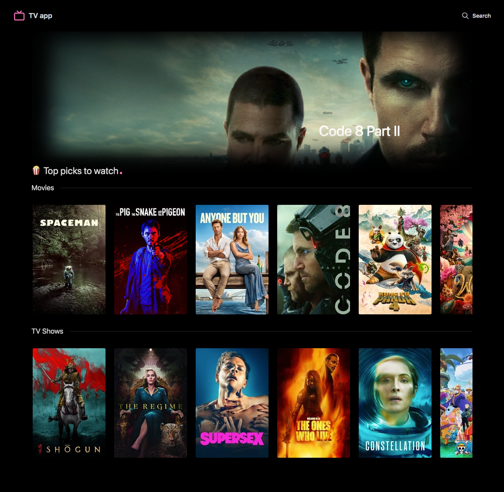
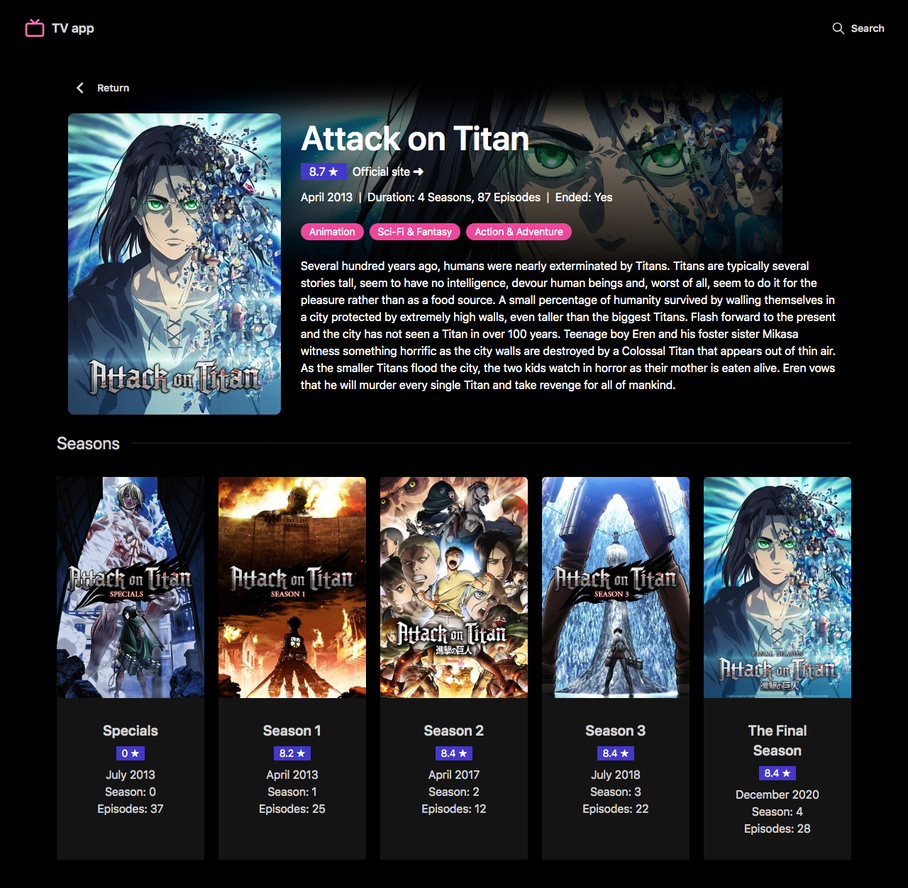
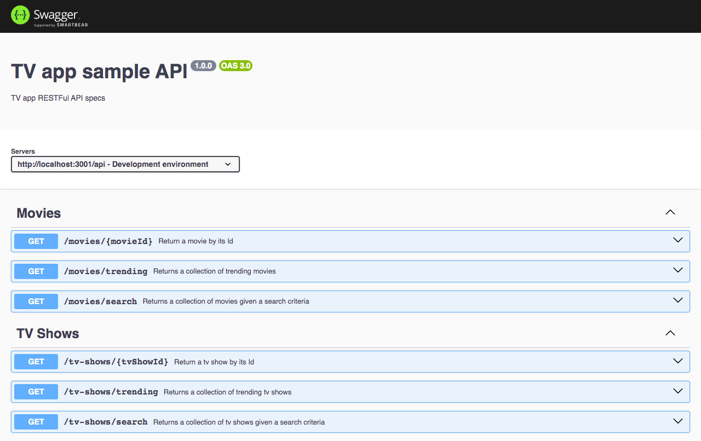
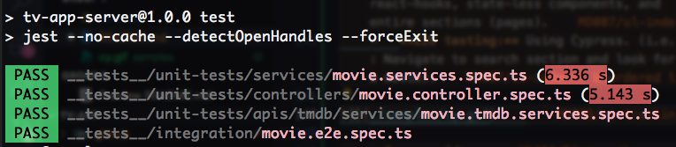
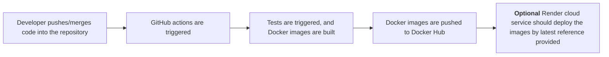
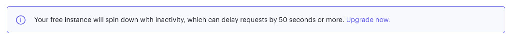
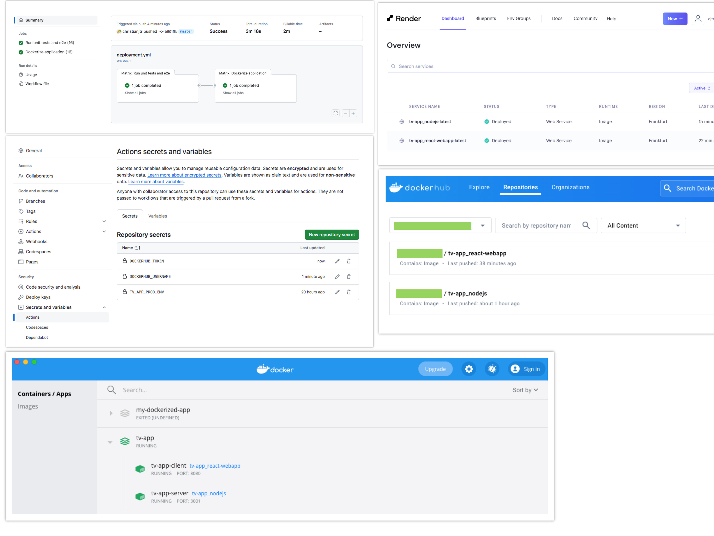

# My TV App application

Proof of concept aimed at putting into practice an e2e development cycle for an application.

> [!NOTE]  
> - :bulb: Monorepo-like project in which services can be deployed and run independently.
> - ❤️ Feel free to add any improvements or suggestions you consider.

1. [Goals](#001)
2. [Considerations](#002)
3. [Tech Stack](#003)
4. [Installation and running the project](#004)
5. [Samples](#005)
6. [Tests (unit-tests and e2e)](#006)
7. [CI/CD - Containerization and Deployment](#007)
8. [Next steps](#008)

<a name="001"></a>
### 🎯 Goals

-   Create an application that displays **trending films and TV shows** in two rails.
-   Integrate the **The Movie DB API (TMDB)** to the application.
-   Add the capability of navigating the application using the keyboard (Arrow keys).
-   Implement a CI/CD process using **GitHub Actions, Docker, and a Cloud application hosting service.**

    #### The movie DB API:

    To implement the solution, we are required to sign up [themoviedb.org](https://www.themoviedb.org/), and also **integrate it to our back-end** then, we will be able to use their API services. For further details, check the specs here [TMDB API specs](https://developer.themoviedb.org/reference/intro/getting-started).

<a name="002"></a>
### Considerations

Please, check this consideration out.

> [!IMPORTANT]
>
> -   The architecture is a **mono repo-like project** that uses **workspaces to share type definitions among the app's tiers**.
> -   The application can be either **started locally or containerized**.
> -   Each app tier, within the project, can be started for development **independently from the others**.

<a name="003"></a>
### Tech Stack

This conceptual test has been developed using the following technologies:

-   **Front-end**
    -   [React](https://react.dev/)
    -   [TypeScript](https://www.typescriptlang.org/)
    -   [Vite](https://vitejs.dev/)
    -   [Tailwind CSS](https://tailwindcss.com/)
    -   [DaisyUI](https://daisyui.com/)
-   **Back-end**
    -   [Express](https://expressjs.com/)
    -   [Node Cache](https://www.npmjs.com/package/node-cache)
    -   [Hapi Joi](https://github.com/hapijs/joi#readme)
    -   [Swagger](https://swagger.io/)
-   **Tests (Unit test and E2E)**
    -   [Jest](https://jestjs.io/)
    -   [React Testing Tools](https://testing-library.com/)
    -   [Cypress](https://www.cypress.io/)
    -   [SuperTest](https://www.npmjs.com/package/supertest)
-   **Containerization and Deployment**
    -   [Github Actions](https://docs.github.com/en/actions)
    -   [Docker](https://www.docker.com/)
    -   [Render](https://render.com/)
-   **Architecture**
    -   [NPM workspaces](https://docs.npmjs.com/cli/v10/using-npm/workspaces)

<a name="004"></a>
### Installation and running the project

The project requires:

-   [NodeJS](https://nodejs.org/)
-   [Docker](https://www.docker.com/)

**Clone the repository:**

```shell
git clone https://github.com/christianjtr/tv-app.git
```

**Scripts:**

Before executing these scripts, you must run **npm install** in the directory you just downloaded/cloned the codebase.

```shell
# Run the entire development environment for both client and server tiers
> npm run dev:app

# Run dev environment for the client-side
> npm run dev:client

# Run development environment for the server-side
> npm run dev:server

# Run unit tests for the client-side tier
> npm run test:client

# Run e2e tests for the client-side tier
> npm run test:client:cy

# Run unit tests for the server-side tier
> npm run test:server

# Build shared types across the application
> npm run build:shared-types

# Perform docker-compose to containerize and run the application
> npm run dev:docker:build-up
```

**Environment variables:**

Each app's tier within the project has its own environment variables file, you **should create a .env file following the templates provided** in the corresponding directory.

| Tier   | template     | directory | environment file to create |
| ------ | ------------ | --------- | -------------------------- |
| client | .env.local   | /app      | .env                       |
| server | .env.example | /server   | .env                       |

<a name="005"></a>
### Samples

##### Live demo

Click on the following link [GitHub page project](https://christianjtr.github.io/tv-app). 

**Note:** It's a mocked version of the project, although we can deploy the front-end project and fetch data from our back-end services hosted.

##### Preview

<p align="center">
    
</p>

##### Home page preview



##### Detail page preview



### Server side

##### API specs

The server-side API follows the [OpenAPI Specification - Version 3](https://swagger.io/specification/)

```shell
# Enter the API's specs documentation by browsing to this URL.

<YOUR HOST>/api/docs
```



<a name="006"></a>
### Tests (unit-tests and e2e)

Both services have some examples of how to develop unit tests and e2e tests (including some mocking strategies).

-   **Client-side:**

    -   Unit testing for services, react-hooks, state-less components, and the entire sections (pages).
    -   **E2E testing:** Using Cypress. (i.e.: Navigate to the search section and look for a movie).


<p align="center">
    
</p>

-   **Server-side:**
    -   Unit testing for services, controllers, etc.
    -   **E2E testing:** Using SuperTest. (i.e.: Simulate a running back-end to perform requests).



<a name="007"></a>
### CI/CD - **Containerization and Deployment**



The strategy followed to deploy the application implies:

##### Containerization of each application

-   Create **Dockerfiles per environment (dev, prod)** to build each application service (client-side, server-side).
-   Every Dockerfile perform a **multi-stage image build**.
-   Consider **workspaces and shared packages** when building images.
-   Create **parametrized docker-compose.yml file per environment (dev, prod)**. (At root folder level only - main Docker context).
-   Create **.dockerignore** files.
-   Create a docker-compose run and build script.
    -   Obtain **production environment variables given the application's source files**.
    -   Provide every docker-compose.yml file with those variables to parametrize them.
    -   **Note:** Google Bard supported me on this.

##### GitHub actions

-   Implement a **GitHub action workflow** which is going to be dispatched whenever a pull-request or merge is performed.
-   Create the repository's project secrets.
    -   Environment variables for production.
    -   Docker credentials
        -   Username.
        -   Docker TOKEN API. (Read, Write permissions).
-   Include jobs:
    -   Run tests.
    -   Containerize applications.
    -   Push applications to Docker Hub.
        -   You must have a **Docker Hub account**.

##### Render (Optional)

> [!IMPORTANT]
>
> - At this point, the services are merged into the repository, tested, containerized, and published on Docker Hub (either as public or private images).
> - Now, you should decide which **Cloud provider service to host your application**. (Azure, Amazon Web Services, Digital Ocean, Google Cloud Platform, and others).

**Choice:** I decided to use [Render](https://render.com/) because it's free for hobby projects (under certain conditions, of course).



Look at this [article on how to deploy pre-built docker images](https://docs.render.com/deploy-an-image) on their side.

-   [TV application](https://tv-app-react-webapp-latest.onrender.com/)
-   [API service docs](https://tv-app-nodejs-latest.onrender.com/api/docs)

    **Note:** The application should consume API services published and provided by our back-end, which is intended to obtain data from the TMDB Movie service).



<a name="008"></a>
### Next steps

-   Extend this documentation to the applications (client-side, server-side, GitHub actions).
-   Enhance Dockerfiles and multi-stage builds.
-   Better use of npm workspaces (mono-repos).
-   Improve overall CD/CI process.
-   Build back-end codebase.
-   Polish up user experience and responsiveness.
